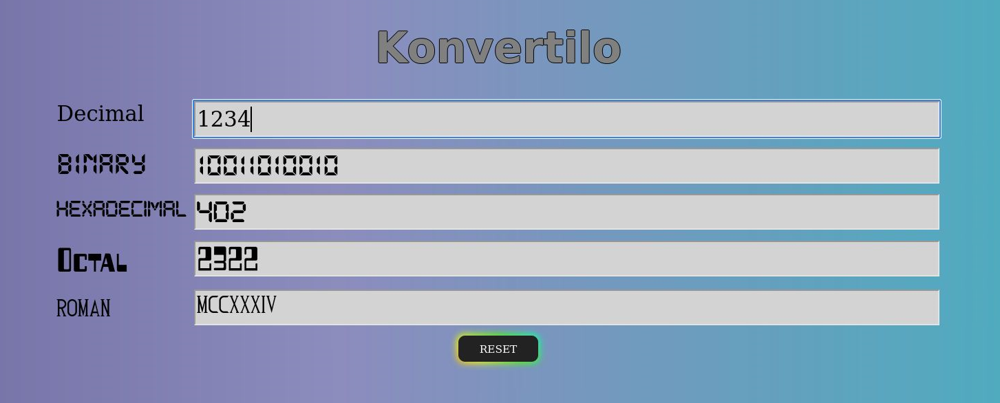

# konvertilo

----

Konvertilo (in Esperanto it means converter) is a simple html tool to convert a number in decimal, hexadecimal, octal, binary and roman format simultaneously.  

   

----

## Built With :

Visual Code Editor  

## Authors

* **Giovanni Palleschi** - [gpalleschi](https://github.com/gpalleschi)  

## Prerequisites :

----

## License :

This project is licensed under the GNU GENERAL PUBLIC LICENSE 3.0 License - see the [LICENSE](LICENSE) file for details
